# Implementation Roadmap: 4.Phases.md - Connect2Go

**Project Name:** Connect2Go (*"Nearby Connect"*)  
**Execution Strategy:** Phased, iterative delivery where each phase culminates in a testable, verifiable milestone.

```mermaid
gantt
    title Connect2Go Development & Delivery Roadmap
    dateFormat  X
    axisFormat  Day %d
    section Backend & Data
    Phase 1: Setup & Scaffolding           :p1, 0, 1
    Phase 2: Schemas & Database Seeding    :p2, 1, 2
    Phase 3: Auth & Profile Subsystems     :p3, 2, 3
    section Core Logic
    Phase 4: Geospatial & Requests Engine  :p4, 3, 5
    Phase 5: Algorithmic Matching Engine   :p5, 5, 6
    section Frontend & Real-Time
    Phase 6: UI Shell & Interactive Map    :p6, 4, 7
    Phase 7: Socket.IO Anonymous Chat      :p7, 7, 9
    Phase 8: Notifications & Safety        :p8, 8, 10
    section Polish & Viva
    Phase 9: End-to-End Testing & Polish   :p9, 10, 11
```

---

## Phase 1: Project Initialization & Environment Configuration
- **Goal:** Set up root workspace, install dependencies, establish environment configurations, and verify runtime health.
- **Tasks:**
  - Create directory structures for `backend/` and `frontend/`.
  - Backend: Initialize `package.json`, install `express`, `mongoose`, `socket.io`, `jsonwebtoken`, `bcryptjs`, `cors`, `dotenv`.
  - Frontend: Initialize Vite + React project, install Tailwind CSS, `lucide-react`, `leaflet`, `react-leaflet`, `socket.io-client`, `axios`.
  - Configure `.env` files with port, JWT secret, and local MongoDB connection string (`mongodb://localhost:27017/connect2go`).
- **Verification Milestone:**
  - `node backend/server.js` starts successfully on port `5000`.
  - `npm run dev` in `frontend/` starts Vite dev server without error.

---

## Phase 2: Database Modeling & Poornima University Seed Data
- **Goal:** Define all Mongoose models with strict validation, indexes, and generate realistic demonstration data.
- **Tasks:**
  - Implement `User` model with GeoJSON `location: { type: "Point", coordinates: [lng, lat] }` and `2dsphere` index.
  - Implement `ActivityRequest` model with `2dsphere` index on `location`, category, target radius, and status.
  - Implement `Conversation`, `Message`, `Notification`, and `Safety` (Report & Block) models.
  - Create `seedData.js` populating Poornima University / Sitapura campus peers (Kinshuk, Kirti, Lavanshu, Lavish) with active requests (Badminton @ Sitapura court, Hackathon prep, Morning Cycling, Exam co-study).
- **Verification Milestone:**
  - Run `npm run seed` in `backend/` and verify collections and `2dsphere` spatial indexes via Mongo Shell / Compass.

---

## Phase 3: Authentication & User Profile Management
- **Goal:** Implement secure, token-based authentication and user profile customizers.
- **Tasks:**
  - Build `POST /api/auth/register` with bcrypt password hashing and duplicate email checks.
  - Build `POST /api/auth/login` returning signed JWT and sanitized user object.
  - Build `GET /api/auth/me` with JWT authentication middleware.
  - Build `PUT /api/users/profile` allowing update of interest tags, availability matrix, and location fuzzing.
  - Frontend: Create `AuthContext`, Login form, Registration form, and Profile Modal.
- **Verification Milestone:**
  - Register a new student user, log in, refresh browser to confirm persistent session, and update interest tags.

---

## Phase 4: Activity Request Engine & Geospatial Search
- **Goal:** Build full lifecycle management of activity requests and spatial search within dynamic radiuses.
- **Tasks:**
  - Build `POST /api/requests`: Create request with coordinates, category, skill level, and radius.
  - Build `GET /api/requests/nearby`: Uses MongoDB `$near` / `$geoWithin` spherical query to fetch requests within `X` km of user.
  - Build author management: `GET /api/requests/my`, `PUT /api/requests/:id` (close/status), and `DELETE /api/requests/:id`.
  - Add Haversine distance calculator to compute distance in km for every returned request.
- **Verification Milestone:**
  - Query `/api/requests/nearby?lat=26.7725&lng=75.8753&radius=3` and confirm all requests within 3 km of Poornima University return with exact distance calculation.

---

## Phase 5: Multi-Variable Algorithmic Matching Engine
- **Goal:** Deliver the multi-factor recommendation engine matching users with ideal activity partners.
- **Tasks:**
  - Implement matching formula in `services/matchingEngine.js`:
    - Distance proximity score (40% weight).
    - Hobby/interest Jaccard similarity (30% weight).
    - Schedule availability overlap (20% weight).
    - Skill level compatibility (10% weight).
  - Build `GET /api/matches` returning top matched requests and peers with breakdown percentages.
  - Frontend: Display dynamic compatibility pill badges (*"95% Match"*, *"88% Match"*) on cards.
- **Verification Milestone:**
  - A user with "Badminton" interest and "Weekday Evenings" availability scores >90% on badminton evening requests within 2 km.

---

## Phase 6: Interactive Map & Discovery UI (UI/UX Pro Max)
- **Goal:** Develop the visual discovery center combining Leaflet maps, dynamic radar circles, and Bento card grids.
- **Tasks:**
  - Implement `MapView.jsx` with OpenStreetMap tiles centered on user location.
  - Implement `RadiusCircle.jsx`: Visual SVG circle that expands/contracts as the user slides the radius control (0.5 km to 25 km).
  - Implement custom SVG markers for requests (color-coded by category) with rich clickable popups.
  - Implement Bento Grid view (`RequestGrid.jsx` & `RequestCard.jsx`) utilizing `shadcn/ui`, `Watermelon UI`, and `21st.dev` design components.
  - Add category filter pills and search bar with debouncing.
  - Implement view toggle (Map View vs Bento Grid View).
- **Verification Milestone:**
  - Adjusting the radius slider from 2 km to 10 km live-updates the radar circle on the map and refreshes the card grid dynamically.

---

## Phase 7: Real-Time Anonymous Chat & Identity Reveal Handshake
- **Goal:** Build the privacy-first Socket.IO real-time chat with masked pseudonyms and the mutual identity reveal handshake.
- **Tasks:**
  - Implement Socket.IO server in `chatSocket.js`: rooms, messages, typing indicators.
  - Implement pseudonym generator (e.g. *"Shadow Runner"*, *"BadminPro #42"*) and Meshy-inspired 3D avatar silhouettes.
  - Build `ChatDrawer.jsx`: Slide-out panel for instant messaging without leaving the map.
  - Build the **"Reveal Identity" Handshake**:
    - User clicks *"Request Identity Reveal"*.
    - Opponent receives confirmation modal.
    - Upon mutual consent, `isRevealed` turns `true`, Swishy AI style celebration triggers, and real profiles are revealed.
- **Verification Milestone:**
  - Open two browser tabs with two different accounts; exchange real-time messages under anonymous pseudonyms, then execute the dual reveal handshake to unlock real identities.

---

## Phase 8: Notification & Moderation Subsystems
- **Goal:** Implement user safety controls (blocking/reporting) and real-time push/in-app notifications.
- **Tasks:**
  - Build `POST /api/safety/block`: Excludes blocked users from queries and chat rooms.
  - Build `POST /api/safety/report`: Submits categorized complaints.
  - Build `Notification.js` model and Socket.IO real-time alert dispatcher.
  - Frontend: Notifications bell icon with unread count badge and slide-down alert tray.
- **Verification Milestone:**
  - Blocking a user immediately hides their requests from the map and stops incoming messages.

---

## Phase 9: Testing, Polish & Academic Viva Presentation Prep
- **Goal:** Final quality assurance, responsive mobile testing, zero console errors, and demo script preparation for Poornima University evaluation.
- **Tasks:**
  - Audit contrast ratios and touch targets using `ui-ux-pro-max` checklist.
  - Verify mobile responsiveness on iPhone/Android viewports.
  - Validate all edge cases (denied location permissions, empty search results, reconnection).
  - Prepare pre-seeded demo walkthrough script for project supervisor (Kireet Sir) and external examiners.
- **Verification Milestone:**
  - Complete end-to-end user walkthrough executed smoothly with 100% feature coverage and zero console warnings.
