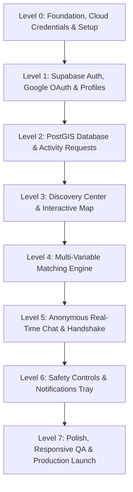

# Implementation Roadmap: Progressive Level-by-Level Build Plan - Connect2Go

**Project Name:** Connect2Go (*"Nearby Connect"*)  
**Execution Strategy:** Progressive Level-based milestone delivery. Each level builds upon the previous, producing a self-contained, testable increment.

---

## Level 0: Foundation, Cloud Credentials & Scaffolding
- **Goal:** Configure developer environment, initialize package dependencies, and establish cloud service connections (Supabase, Cloudinary, Google OAuth).
- **Deliverables:**
  - Initialize Vite + React frontend (`frontend/package.json`) and Express backend (`backend/package.json`).
  - Configure `.env` with:
    - `VITE_SUPABASE_URL` & `VITE_SUPABASE_ANON_KEY`
    - `SUPABASE_SERVICE_ROLE_KEY` (backend)
    - `VITE_CLOUDINARY_CLOUD_NAME` & `VITE_CLOUDINARY_UPLOAD_PRESET`
    - `GOOGLE_CLIENT_ID`
  - Setup Tailwind CSS with custom color tokens (`#22C55E` Emerald, `#A7F3D0` Mint, `#0F172A` Text, `#F8FAFC` Canvas).
- **Verification Milestone:**
  - Frontend dev server boots cleanly (`npm run dev`), Supabase client initializes without connection errors.

---

## Level 1: Authentication, Google OAuth & Cloudinary Profiles
- **Goal:** Enable user registration, Google social sign-in, profile customization, and avatar uploads.
- **Deliverables:**
  - Supabase `auth.users` connection with **Google OAuth 2.0** and Email/Password flows.
  - PostgreSQL trigger to automatically create a row in `public.profiles` upon sign-up.
  - Avatar uploader directly linked to **Cloudinary** with automated face-centered square cropping (`c_fill,g_face,w_300,h_300`).
  - Profile customization screen: Name, username, bio, interest tags (e.g. Badminton, Running, Coding), and availability matrix.
- **Verification Milestone:**
  - Sign in with Google or Email, upload a profile photo to Cloudinary, update hobbies, and verify profile persistence in Supabase.

---

## Level 2: PostGIS Database & Activity Request Lifecycle
- **Goal:** Implement database schema in Supabase with PostGIS spatial indexing and CRUD endpoints for activity requests.
- **Deliverables:**
  - Run SQL migrations in Supabase SQL editor: `profiles`, `activity_requests`, `conversations`, `messages`, `notifications`, `safety_reports`.
  - Enable PostGIS extension: `create extension if not exists postgis;`.
  - Create `CreateActivityModal.jsx`: Form with category picker, date-time, radius slider ($0.5\text{ km} - 25\text{ km}$), description, and optional Cloudinary banner image.
  - Deploy `get_nearby_activities` PostGIS SQL function calculating exact distance in kilometers using `ST_DWithin` and `ST_Distance`.
- **Verification Milestone:**
  - Post an activity request ("Badminton Partner within 2 km"), confirm PostGIS records location point, and retrieve it using spatial radius query.

---

## Level 3: Discovery Center & Interactive Map (UI/UX Pro Max)
- **Goal:** Develop the visual discovery hub featuring Leaflet interactive maps, dynamic radar circle, and Bento card grid.
- **Deliverables:**
  - `MapView.jsx`: OpenStreetMap tile layer centered on active user coordinates.
  - `RadiusCircle.jsx`: Live SVG radar circle that visually expands and contracts as user shifts the radius slider.
  - Custom category-themed map pins with rich clickable popups.
  - `RequestGrid.jsx` & `RequestCard.jsx`: Bento box layout with distance pill, date/time, participant meter, and `[Join / Chat]` CTA.
  - "People Near You" horizontal avatar carousel.
  - Category pill filter bar (`All`, `Sports`, `Fitness`, `Gaming`, `Study`, `Food`, `Travel`, `Others`).
- **Verification Milestone:**
  - Adjusting the radius slider from 2 km to 10 km live-updates the radar circle on the map and updates the card grid with zero lag.

---

## Level 4: Multi-Factor Algorithmic Matching Engine
- **Goal:** Automatically compute compatibility between users and nearby activity requests.
- **Deliverables:**
  - Matching engine algorithm:
    $$\text{MatchScore} = (0.40 \times \text{Distance}) + (0.30 \times \text{Interests}) + (0.20 \times \text{Availability}) + (0.10 \times \text{Skill})$$
  - API / Service to rank nearby requests and suggest high-compatibility matches.
  - Display dynamic compatibility pill badges (*"95% Match"*, *"88% Match"*) with explanatory tags on cards.
- **Verification Milestone:**
  - A user with "Badminton" interest and "Evening" availability scores $>90\%$ compatibility on nearby badminton evening requests.

---

## Level 5: Anonymous Real-Time Chat & Identity Reveal Handshake
- **Goal:** Build the privacy-first real-time messaging experience with masked pseudonyms and the mutual reveal handshake.
- **Deliverables:**
  - Real-time message streaming powered by Supabase Realtime / WebSockets.
  - Default masked mode: Users chat under playful pseudonyms (e.g. *"Shadow Runner"*, *"BadminPro #42"*) with 3D avatars. Real names and Cloudinary avatars are concealed.
  - Dual "Reveal Identity" Protocol:
    1. Either participant clicks **"Request Identity Reveal"**.
    2. Opponent receives an interactive confirmation modal.
    3. When both approve, celebratory animation triggers (Swishy AI style), conversation updates to `is_revealed = true`, and verified Cloudinary profile pictures and real names are permanently unveiled.
- **Verification Milestone:**
  - Open two browser sessions with different accounts; exchange real-time messages under masked identities, execute the dual reveal handshake, and verify full profiles unlock.

---

## Level 6: Safety Controls, Notifications & Settings
- **Goal:** Implement user safety measures (blocking/reporting), residential location fuzzing, and in-app notification trays.
- **Deliverables:**
  - User blocking: Blocked users cannot message or view requests.
  - Reporting modal with categorized violation codes (*Harassment*, *Spam*, *Inappropriate behavior*).
  - Residential location privacy fuzzing: Adds a ~400m jitter to broadcasted coordinates when enabled.
  - In-app notification bell icon with unread badges for match suggestions and chat messages.
  - Clean Settings page: Account, Privacy, Location, Blocked Users, Logout.
- **Verification Milestone:**
  - Blocking an abusive user immediately terminates active chat and removes their activities from the discovery map.

---

## Level 7: Final Polish, Responsive QA & Launch Readiness
- **Goal:** Mobile viewport testing, WCAG 2.1 AA accessibility audit, skeleton loaders, and production build readiness.
- **Deliverables:**
  - Verify mobile responsiveness from `375px` (iPhone SE) up to `1920px` desktop.
  - Audit touch targets ($\ge 44 \times 44\text{px}$) and contrast ratios ($\ge 4.5:1$).
  - Replace all blocking spinners with subtle shimmer skeleton loaders.
  - Ensure zero console errors or unhandled exceptions.
- **Verification Milestone:**
  - Flawless, full end-to-end walkthrough from landing page to real-time chat with 100% feature reliability.
