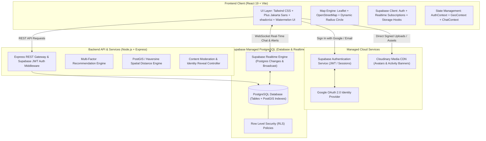

# System Architecture & Technical Design - Connect2Go

**Project Name:** Connect2Go (*"Nearby Connect"*)  
**Version:** 2.0.0 (Supabase + Cloudinary Architecture)  
**Core Technologies:**
- **Frontend:** React 19 (Vite), Tailwind CSS, Leaflet / React-Leaflet, Lucide Icons
- **Backend Service:** Node.js (v22), Express.js / Supabase Edge Functions
- **Database:** Supabase (PostgreSQL + PostGIS geospatial extensions)
- **Authentication:** Supabase Auth (Email/Password + Google OAuth 2.0)
- **Media & Image Storage:** Cloudinary (CDN-optimized image transformations)
- **Real-Time Communication:** Supabase Realtime (WebSockets) & Socket.IO

---

## 1. High-Level System Architecture



---

## 2. End-to-End User Experience & Data Flows

### 2.1 The Complete User Journey Flow
```
1. DISCOVERY & ONBOARDING
   User Lands ➔ Authenticates via Supabase (Email or Google OAuth) 
   ➔ Grants Location (or picks city pin) ➔ Sets 3+ Hobby/Interest Tags 
   ➔ Uploads Profile Picture (stored on Cloudinary)

2. EXPLORATION (MAP & BENTO CARDS)
   Interactive Leaflet Map loads with User at Center
   ➔ Live Radius Circle displays (e.g. 5 km)
   ➔ PostGIS fetches open activities & peers within radius
   ➔ Cards show Match Score (e.g. "94% Match • Badminton • 1.2 km away")

3. CREATING AN ACTIVITY REQUEST
   User clicks [Create Activity] ➔ Selects Category, Date, Time Window, Radius
   ➔ Uploads optional activity cover image to Cloudinary
   ➔ Request broadcasts to nearby users matching those tags

4. SAFE ANONYMOUS CHAT
   Interested user taps [Join / Chat] ➔ Opens Real-Time Anonymous Thread
   ➔ Identities masked with pseudonyms ("Shadow Runner") & 3D avatars
   ➔ Coordinates/chat stored securely in Supabase with Realtime updates

5. MUTUAL REVEAL & REAL-WORLD MEETUP
   Both users get comfortable ➔ Either taps "Request Identity Reveal"
   ➔ Peer accepts handshake ➔ Real Cloudinary profile photos & names unlocked
   ➔ Peers coordinate offline activity safely in the real world
```

---

## 3. Database Schema (Supabase PostgreSQL Tables)

### 3.1 `profiles` Table
*(Automatically linked to Supabase `auth.users` via trigger)*
```sql
create table public.profiles (
  id uuid references auth.users on delete cascade primary key,
  full_name text not null,
  username text unique,
  avatar_url text, -- Cloudinary secure URL
  bio text,
  interests text[] default '{}',
  availability jsonb default '{"weekdays": [], "weekends": [], "availableNow": false}',
  latitude double precision,
  longitude double precision,
  location geography(Point, 4326), -- PostGIS point for geospatial index
  is_location_fuzzed boolean default false,
  blocked_users uuid[] default '{}',
  created_at timestamp with time zone default timezone('utc'::text, now()) not null,
  updated_at timestamp with time zone default timezone('utc'::text, now()) not null
);

-- Geospatial Index
create index profiles_geo_idx on public.profiles using gist(location);
```

### 3.2 `activity_requests` Table
```sql
create table public.activity_requests (
  id uuid default gen_random_uuid() primary key,
  creator_id uuid references public.profiles(id) on delete cascade not null,
  title text not null,
  category text not null, -- Sports, Fitness, Gaming, Study, Food, Travel, Others
  description text,
  skill_level text default 'Open to All',
  radius_km numeric default 5.0,
  latitude double precision not null,
  longitude double precision not null,
  location geography(Point, 4326) not null,
  address text,
  scheduled_date date not null,
  time_window text not null,
  participant_count int default 2,
  joined_count int default 1,
  status text default 'open', -- open, filled, completed, cancelled
  image_url text, -- Cloudinary banner URL
  created_at timestamp with time zone default timezone('utc'::text, now()) not null
);

create index activity_requests_geo_idx on public.activity_requests using gist(location);
```

### 3.3 `conversations` & `messages` Tables
```sql
create table public.conversations (
  id uuid default gen_random_uuid() primary key,
  activity_request_id uuid references public.activity_requests(id) on delete set null,
  is_anonymous boolean default true,
  masked_aliases jsonb default '{}', -- {"user_id_1": "BadminPro #42", "user_id_2": "Campus Hawk"}
  reveal_requested_by uuid[] default '{}',
  is_revealed boolean default false,
  created_at timestamp with time zone default timezone('utc'::text, now()) not null,
  updated_at timestamp with time zone default timezone('utc'::text, now()) not null
);

create table public.conversation_participants (
  conversation_id uuid references public.conversations(id) on delete cascade,
  user_id uuid references public.profiles(id) on delete cascade,
  primary key (conversation_id, user_id)
);

create table public.messages (
  id uuid default gen_random_uuid() primary key,
  conversation_id uuid references public.conversations(id) on delete cascade not null,
  sender_id uuid references public.profiles(id) on delete cascade not null,
  sender_alias text,
  text text not null,
  is_read boolean default false,
  created_at timestamp with time zone default timezone('utc'::text, now()) not null
);
```

### 3.4 `safety_reports` & `notifications` Tables
```sql
create table public.safety_reports (
  id uuid default gen_random_uuid() primary key,
  reporter_id uuid references public.profiles(id) on delete cascade not null,
  target_user_id uuid references public.profiles(id) on delete cascade,
  target_request_id uuid references public.activity_requests(id) on delete cascade,
  category text not null,
  details text,
  status text default 'pending',
  created_at timestamp with time zone default timezone('utc'::text, now()) not null
);

create table public.notifications (
  id uuid default gen_random_uuid() primary key,
  recipient_id uuid references public.profiles(id) on delete cascade not null,
  sender_id uuid references public.profiles(id) on delete cascade,
  type text not null,
  title text not null,
  body text not null,
  reference_id uuid,
  is_read boolean default false,
  created_at timestamp with time zone default timezone('utc'::text, now()) not null
);
```

---

## 4. PostGIS Geospatial Radius Query Function

In Supabase, radius discovery executes in milliseconds using this SQL stored procedure:

```sql
create or replace function get_nearby_activities(
  user_lat double precision,
  user_lng double precision,
  max_radius_km double precision,
  filter_category text default null
)
returns table (
  id uuid,
  creator_id uuid,
  title text,
  category text,
  description text,
  skill_level text,
  scheduled_date date,
  time_window text,
  distance_km double precision,
  image_url text,
  participant_count int,
  joined_count int,
  status text
) language sql stable as $$
  select 
    ar.id,
    ar.creator_id,
    ar.title,
    ar.category,
    ar.description,
    ar.skill_level,
    ar.scheduled_date,
    ar.time_window,
    round((ST_Distance(ar.location, ST_SetSRID(ST_MakePoint(user_lng, user_lat), 4326)::geography) / 1000)::numeric, 2)::double precision as distance_km,
    ar.image_url,
    ar.participant_count,
    ar.joined_count,
    ar.status
  from public.activity_requests ar
  where ST_DWithin(
    ar.location,
    ST_SetSRID(ST_MakePoint(user_lng, user_lat), 4326)::geography,
    max_radius_km * 1000
  )
  and ar.status = 'open'
  and (filter_category is null or filter_category = 'All' or ar.category = filter_category)
  order by distance_km asc;
$$;
```

---

## 5. Cloudinary Media Pipeline Architecture

1. **Client Signature Request:** Client requests an upload signature or utilizes a secure unsigned preset configured for avatars/activities.
2. **Transformations on Delivery:**
   - User Avatars: `c_fill,g_face,w_300,h_300,r_max,f_auto,q_auto` (circular face-centered crop, webp format).
   - Activity Cover Banners: `c_fill,w_800,h_450,f_auto,q_auto` (16:9 modern card ratio).
3. **Database URL Persistence:** Only the lightweight transformed HTTPS URL string is stored in Supabase, keeping DB footprint tiny and performance instant.
