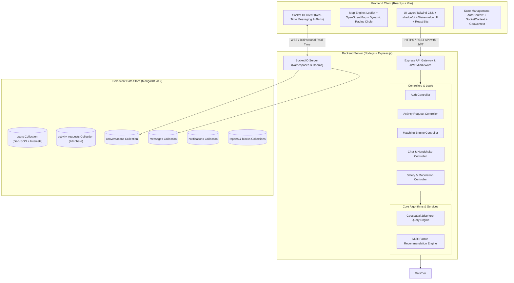
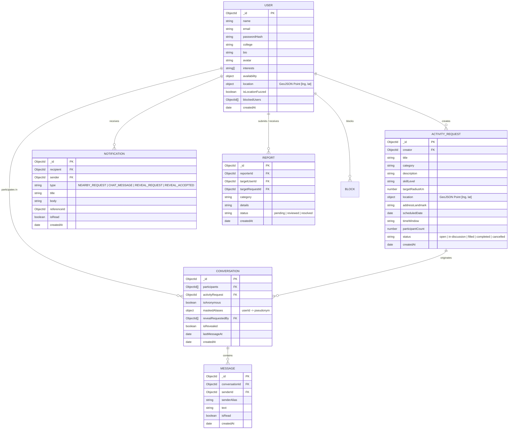

# System Architecture & Technical Design - Connect2Go

**Project Name:** Connect2Go (*"Nearby Connect"*)  
**Version:** 1.0.0  
**Target Environment:** Node.js (v22+), React (v19+ / Vite), MongoDB (v8+), Socket.IO (v4+)

---

## 1. High-Level System Architecture



---

## 2. Data Flow Architecture (DFD)

### 2.1 Level-0 DFD (Context Level)
```mermaid
flowchart LR
    User([User / Browser])
    Connect2Go[[Connect2Go Platform]]
    MongoDB[(MongoDB Database)]
    GeoService[HTML5 Geolocation API]
    SocketService[Socket.IO Gateway]

    User -->|1. Credentials, Profile & Interests| Connect2Go
    GeoService -->|2. GPS Coordinates [Lng, Lat]| User
    User -->|3. Post Activity Request with Radius| Connect2Go
    Connect2Go -->|4. Geospatial Queries & Data Storage| MongoDB
    MongoDB -->|5. Nearby Users & Matching Requests| Connect2Go
    Connect2Go -->|6. Nearby Pins, Recommendations & Badges| User
    User <-->|7. Anonymous Chat & Identity Reveal Handshake| SocketService
    SocketService <-->|8. Instant Message Dispatch & Typing Events| Connect2Go
```

### 2.2 Level-1 DFD (Subsystems & Modules)
```mermaid
flowchart TD
    User([User])
    AuthMod[1.0 Auth Subsystem]
    ProfileMod[2.0 Profile & Interest Subsystem]
    RequestMod[3.0 Request Management Subsystem]
    GeoDiscovery[4.0 Geospatial & Radius Search]
    MatchEngine[5.0 Matching Engine]
    ChatService[6.0 Real-Time Chat & Reveal Protocol]
    SafetyMod[7.0 Safety & Moderation]

    User -->|Register / Login| AuthMod
    AuthMod -->|Validate & Generate Token| User
    User -->|Edit Hobbies & Availability| ProfileMod
    User -->|Create Request [Category, Radius, Time]| RequestMod
    RequestMod -->|Store GeoJSON Point| GeoDiscovery
    User -->|Filter by Radius & Activity| GeoDiscovery
    GeoDiscovery -->|Fetch Spatial Candidates| MatchEngine
    ProfileMod -->|Read Hobbies & Schedules| MatchEngine
    MatchEngine -->|Calculate Score: Distance + Interests + Schedule| User
    User -->|Initiate Chat on Request| ChatService
    ChatService -->|Mask Identity under Pseudonym| User
    User -->|Trigger Mutual Reveal| ChatService
    User -->|Block / Report| SafetyMod
    SafetyMod -->|Exclude from Discovery & Chat| GeoDiscovery
```

---

## 3. Entity-Relationship Model (ERD) & Database Schemas



---

## 4. End-to-End File & Folder Directory Structure

```plaintext
d:/Other Projects/Connect2Go/
├── PRD.md                       # Comprehensive Product Requirements Document
├── Architecture.md              # System Architecture & API/DB Design (this document)
├── Rules.md                     # AI & Engineering Guardrails and Standards
├── 4.Phases.md                  # Detailed Execution Roadmap (Phases 1-9)
├── Design.md                    # Visual Identity, Theme, Colors, Fonts & UI Specs
├── Memory.md                    # State & Project Memory Tracker
│
├── backend/                     # Node.js + Express + Socket.IO Server
│   ├── package.json
│   ├── .env.example
│   ├── .env
│   ├── server.js                # App entrypoint (HTTP + WebSockets)
│   └── src/
│       ├── config/
│       │   └── db.js            # MongoDB Mongoose connection with 2dsphere check
│       ├── models/
│       │   ├── User.js          # User schema with GeoJSON index
│       │   ├── ActivityRequest.js # Request schema with 2dsphere index
│       │   ├── Conversation.js  # Chat threads with anonymous/reveal state
│       │   ├── Message.js       # Individual chat messages
│       │   ├── Notification.js # In-app alerts
│       │   └── Safety.js        # Report & Block models
│       ├── middleware/
│       │   ├── auth.js          # JWT verification & req.user attachment
│       │   └── errorHandler.js  # Centralized error handler
│       ├── controllers/
│       │   ├── authController.js
│       │   ├── userController.js
│       │   ├── requestController.js
│       │   ├── matchController.js
│       │   ├── chatController.js
│       │   └── safetyController.js
│       ├── services/
│       │   ├── matchingEngine.js # Multi-factor score calculator
│       │   └── pseudonymGenerator.js # Fun anonymous aliases generator
│       ├── sockets/
│       │   └── chatSocket.js    # Socket.IO rooms, messages, typing & handshake
│       ├── routes/
│       │   ├── authRoutes.js
│       │   ├── userRoutes.js
│       │   ├── requestRoutes.js
│       │   ├── matchRoutes.js
│       │   ├── chatRoutes.js
│       │   └── safetyRoutes.js
│       └── utils/
│           ├── geoUtils.js      # Haversine distance, jitter/fuzzing
│           └── seedData.js      # Poornima University & Sitapura campus seed data
│
└── frontend/                    # Vite + React 19 + Tailwind CSS Client
    ├── package.json
    ├── vite.config.js
    ├── tailwind.config.js
    ├── postcss.config.js
    ├── index.html
    └── src/
        ├── main.jsx             # React DOM root
        ├── App.jsx              # Router & layout provider
        ├── index.css            # Tailwind directives + custom styles
        ├── context/
        │   ├── AuthContext.jsx  # Authentication state & JWT handling
        │   ├── SocketContext.jsx# Real-time WebSocket connection
        │   └── GeoContext.jsx   # Browser GPS & active location state
        ├── services/
        │   ├── api.js           # Axios instance with interceptors
        │   └── socket.js        # Socket.IO client helper
        ├── components/
        │   ├── layout/
        │   │   ├── Navbar.jsx   # Top navigation with status & notification badge
        │   │   ├── Sidebar.jsx  # Category & filter controls
        │   │   └── Footer.jsx   # Poornima University project footer
        │   ├── map/
        │   │   ├── MapView.jsx  # Leaflet map container
        │   │   ├── RadiusCircle.jsx # Live radar search radius visualizer
        │   │   └── RequestMarker.jsx# Custom pins & interactive popups
        │   ├── requests/
        │   │   ├── RequestCard.jsx  # Bento-style activity card with match %
        │   │   ├── RequestGrid.jsx  # Grid layout for requests
        │   │   └── CreateRequestModal.jsx # Activity creation modal
        │   ├── chat/
        │   │   ├── ChatDrawer.jsx   # Slide-out real-time chat interface
        │   │   ├── MessageList.jsx  # Chat bubble feed with timestamps
        │   │   ├── RevealModal.jsx  # Two-way identity handshake modal
        │   │   └── TypingIndicator.jsx
        │   ├── profile/
        │   │   ├── ProfileModal.jsx # User profile, hobbies & availability
        │   │   └── AvatarPicker.jsx # 3D Meshy-inspired avatar selector
        │   ├── safety/
        │   │   ├── ReportModal.jsx  # User/request moderation form
        │   │   └── BlockModal.jsx   # Block confirmation
        │   └── ui/              # shadcn/ui + Watermelon UI primitives
        │       ├── button.jsx
        │       ├── card.jsx
        │       ├── badge.jsx
        │       ├── slider.jsx
        │       ├── dialog.jsx
        │       └── input.jsx
        └── pages/
            ├── DashboardPage.jsx# Primary view (Map + Bento Grid + Radar)
            ├── LoginPage.jsx    # User sign-in
            ├── RegisterPage.jsx # Account sign-up with campus preset
            ├── MyRequestsPage.jsx # Manage user's active/past posts
            └── MessagesPage.jsx # Dedicated chat inbox
```

---

## 5. REST API Specifications

| Method | Endpoint | Description | Auth Required | Request Body / Query Params |
| :--- | :--- | :--- | :--- | :--- |
| `POST` | `/api/auth/register` | Register new user | No | `{ name, email, password, college, location }` |
| `POST` | `/api/auth/login` | Authenticate user & get JWT | No | `{ email, password }` |
| `GET` | `/api/auth/me` | Fetch authenticated user | Yes (JWT) | None |
| `PUT` | `/api/users/profile` | Update profile, interests & schedule | Yes (JWT) | `{ bio, interests, availability, isLocationFuzzed }` |
| `PUT` | `/api/users/location` | Update user coordinates | Yes (JWT) | `{ latitude, longitude }` |
| `POST` | `/api/requests` | Create an activity request | Yes (JWT) | `{ title, category, description, skillLevel, radius, location, scheduledDate, participantCount }` |
| `GET` | `/api/requests/nearby` | Retrieve nearby requests within radius | Yes (JWT) | `?lat=...&lng=...&radius=...&category=...` |
| `GET` | `/api/requests/:id` | Get activity request details | Yes (JWT) | None |
| `PUT` | `/api/requests/:id` | Update / close activity request | Yes (JWT) | `{ status }` |
| `DELETE`| `/api/requests/:id` | Delete activity request | Yes (JWT) | None |
| `GET` | `/api/matches` | Get algorithmic matches for user | Yes (JWT) | `?radius=...` |
| `POST` | `/api/chat/conversations`| Start/find chat thread for request | Yes (JWT) | `{ requestId, recipientId }` |
| `GET` | `/api/chat/conversations`| List user conversations | Yes (JWT) | None |
| `GET` | `/api/chat/messages/:id` | Fetch message history for thread | Yes (JWT) | None |
| `POST` | `/api/chat/reveal/:id` | Request / accept identity reveal | Yes (JWT) | `{ action: "REQUEST" \| "ACCEPT" \| "DECLINE" }` |
| `POST` | `/api/safety/block` | Block an offensive user | Yes (JWT) | `{ targetUserId }` |
| `POST` | `/api/safety/report` | Submit abuse report | Yes (JWT) | `{ targetUserId, requestId, category, details }` |
| `GET` | `/api/notifications` | Get user notifications | Yes (JWT) | None |
| `PUT` | `/api/notifications/read`| Mark alerts as read | Yes (JWT) | `{ notificationIds }` |

---

## 6. Real-Time WebSockets Architecture (Socket.IO)

### 6.1 Socket Events Protocol

| Event Name | Direction | Payload | Description |
| :--- | :--- | :--- | :--- |
| `join_conversation` | Client $\to$ Server | `{ conversationId }` | User enters specific conversation room |
| `leave_conversation`| Client $\to$ Server | `{ conversationId }` | User leaves conversation room |
| `send_message` | Client $\to$ Server | `{ conversationId, text }` | Dispatches new chat message |
| `receive_message` | Server $\to$ Client | `{ _id, conversationId, senderId, senderAlias, text, createdAt }` | Broadcasted to room participants |
| `typing_start` | Client $\to$ Server | `{ conversationId, alias }` | Notifies that peer is typing |
| `typing_stop` | Client $\to$ Server | `{ conversationId }` | Typing stopped |
| `reveal_requested` | Server $\to$ Client | `{ conversationId, requesterAlias }` | Handshake prompt sent to peer |
| `reveal_unlocked` | Server $\to$ Client | `{ conversationId, users: [profiles] }` | Dual consent achieved; real profiles unlocked |
| `notification` | Server $\to$ Client | `{ type, title, body, referenceId }` | Live toast alert for matches & messages |
